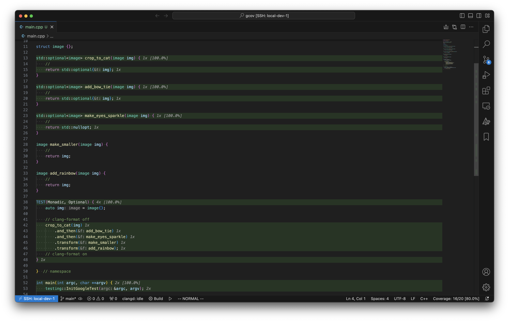
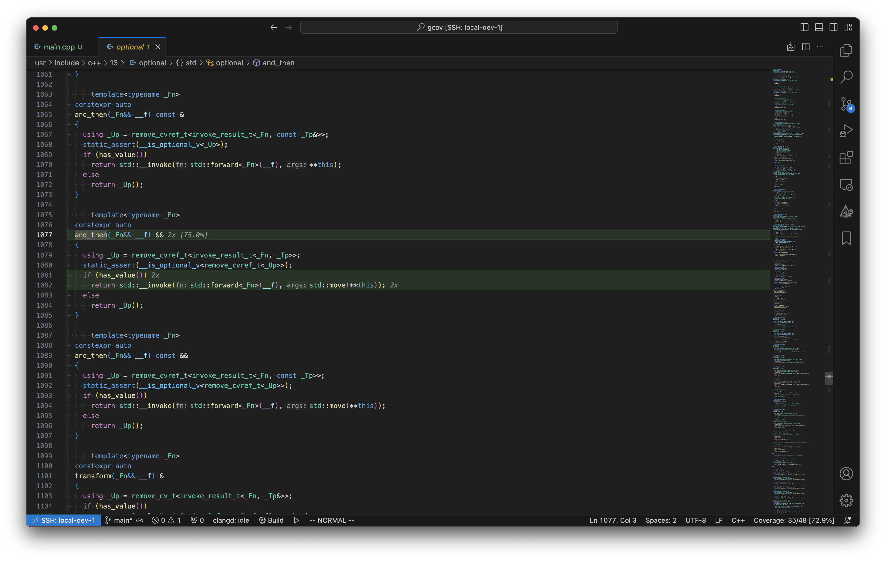
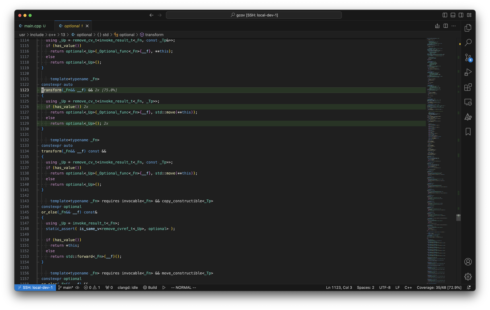

# Докер:
```bash
sudo docker build . -t ${container_name}
sudo docker run -it ${container-name}
```

Внутри будут сгенеренные gcov файлики

# Ручками
На Ubuntu 23.10 (Mantic Minotaur)
```bash
sudo apt install -y cmake g++-13 libgtest-dev
CXX=g++-13 cmake -B build -D CMAKE_BUILD_TYPE=Debug
cmake --build build
ctest -T Test -T Coverage --test-dir build
```

Для vscode есть плагин gcov viewer




